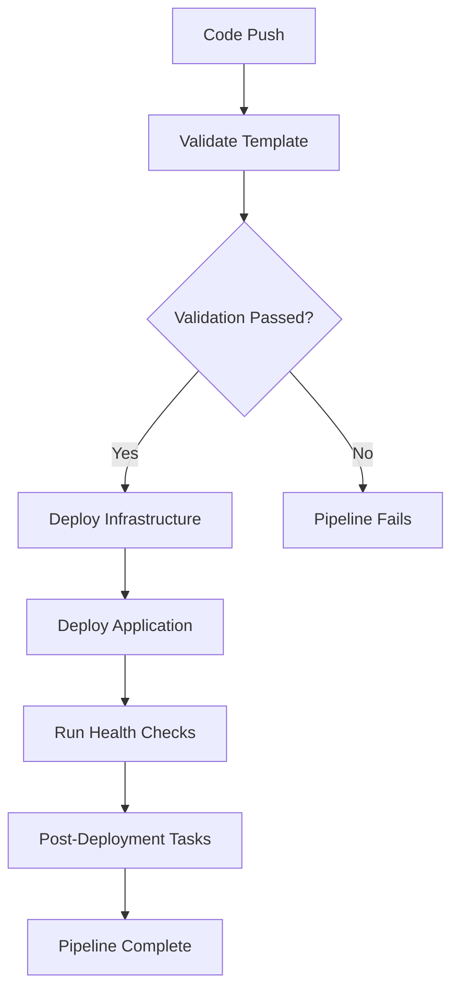

# Azure DevOps Pipeline Setup Guide

This guide provides detailed instructions for setting up and configuring the Azure DevOps pipeline for automated deployment of the AI Chatbot with Sidecar application.

## 📋 Overview

The pipeline (`azure-pipelines-sidecar.yml`) provides:
- **Automated validation** of Bicep templates
- **Infrastructure deployment** using Azure Resource Manager
- **Application deployment** with Node.js dependencies
- **Health verification** and testing
- **Multi-stage deployment** with approval gates

## 🏗️ Pipeline Architecture



## 🛠️ Prerequisites

### Azure DevOps Setup

1. **Azure DevOps Organization**
   - Create or access your Azure DevOps organization
   - Ensure you have project creation permissions

2. **Service Connections**
   - Azure Resource Manager service connection
   - Appropriate subscription permissions

3. **Agent Pool**
   - Microsoft-hosted agents (ubuntu-latest)
   - Or self-hosted agents with required tools

### Azure Permissions

Required RBAC roles for the service principal:
- **Contributor** on the target subscription/resource group
- **User Access Administrator** (if creating role assignments)

## 🚀 Pipeline Setup Steps

### Step 1: Create Service Connection

1. **Navigate to Project Settings**
   ```
   Azure DevOps → Your Project → Project Settings → Service Connections
   ```

2. **Create New Service Connection**
   - Choose **Azure Resource Manager**
   - Select **Service Principal (automatic)**
   - Configure:
     ```
     Connection Name: MSFT-NonProd-DevOpsConnection
     Subscription: Your Azure Subscription
     Resource Group: (Optional - leave empty for subscription-level)
     ```

3. **Verify Connection**
   - Test the connection before saving
   - Grant pipeline permissions if prompted

### Step 2: Import Pipeline

#### Option A: YAML Pipeline

1. **Create New Pipeline**
   ```
   Pipelines → Create Pipeline → Azure Repos Git → Select Repository
   ```

2. **Choose Existing YAML**
   - Select `azure-pipelines-sidecar.yml`
   - Review and run

#### Option B: Classic Editor

1. **Use Classic Editor**
   - Import YAML as template
   - Configure variables through UI

### Step 3: Configure Variables

#### Pipeline Variables

Set these variables in your pipeline:

| Variable | Default Value | Description |
|----------|---------------|-------------|
| `azureServiceConnection` | `MSFT-NonProd-DevOpsConnection` | Service connection name |
| `resourceGroupName` | `rg-chatbot-sidecar-nonprod` | Target resource group |
| `location` | `eastus` | Azure region |
| `bicepFile` | `ARM_Deployments/ChatbotAppService/ChatbotAppService-Sidecar.bicep` | Bicep template path |
| `bicepParamsFile` | `ARM_Deployments/ChatbotAppService/ChatbotAppService-Sidecar.bicepparam` | Parameters file path |
| `appSourcePath` | `ARM_Deployments/ChatbotAppService/sidecar-app` | Application source code |

#### Variable Groups (Optional)

Create variable groups for different environments:

```yaml
# Production Variables
variables:
- group: ChatbotSidecar-Prod
  # Contains:
  # - resourceGroupName: rg-chatbot-sidecar-prod
  # - bicepParamsFile: parameters-production.bicepparam
```

### Step 4: Configure Triggers

#### Branch Triggers

```yaml
trigger:
  branches:
    include:
    - main
    - feature/*
    - hotfix/*
  paths:
    include:
    - ARM_Deployments/ChatbotAppService/*
    exclude:
    - ARM_Deployments/ChatbotAppService/README.md
```

#### Manual Triggers

```yaml
# Disable CI trigger for manual deployments
trigger: none

# Enable manual trigger with parameters
parameters:
- name: environment
  displayName: 'Deployment Environment'
  type: string
  default: 'nonprod'
  values:
  - nonprod
  - prod
```

## 🎯 Pipeline Stages

### Stage 1: Validation

**Purpose**: Validate Bicep templates and configuration

**Tasks**:
- Checkout source code
- Display configuration info
- Validate Bicep template syntax
- Check parameter file structure
- Verify resource group existence

**Success Criteria**:
- Template validation passes
- No syntax errors
- All required parameters present

### Stage 2: Infrastructure Deployment

**Purpose**: Deploy Azure resources using Bicep

**Tasks**:
- Setup Node.js environment
- Deploy Bicep template
- Configure App Service settings
- Setup Application Insights
- Create Log Analytics workspace

**Success Criteria**:
- All resources deployed successfully
- Outputs available for next stage
- No deployment errors

### Stage 3: Application Deployment

**Purpose**: Deploy Node.js application code

**Tasks**:
- Install Node.js dependencies
- Package application files
- Deploy to App Service
- Configure environment variables
- Setup health endpoints

**Success Criteria**:
- Application deployed successfully
- Dependencies installed
- Health endpoints accessible

### Stage 4: Post-Deployment

**Purpose**: Verify deployment and provide information

**Tasks**:
- Test health endpoints
- Verify sidecar connectivity
- Display access URLs
- Generate deployment report

**Success Criteria**:
- Health checks pass
- Application accessible
- Sidecar responding

## 🔧 Customization Options

### Environment-Specific Deployments

#### Multiple Parameter Files

```yaml
# Use different parameter files per environment
variables:
  ${{ if eq(variables['Build.SourceBranch'], 'refs/heads/main') }}:
    bicepParamsFile: 'ARM_Deployments/ChatbotAppService/parameters-production.bicepparam'
  ${{ else }}:
    bicepParamsFile: 'ARM_Deployments/ChatbotAppService/ChatbotAppService-Sidecar.bicepparam'
```

#### Conditional Stages

```yaml
# Deploy to prod only from main branch
- stage: DeployProduction
  condition: eq(variables['Build.SourceBranch'], 'refs/heads/main')
  dependsOn: DeployNonProd
```

### Approval Gates

#### Environment Protection

```yaml
# Add approval gate for production
- deployment: DeployToProd
  environment: 'ChatbotSidecar-Production'
  strategy:
    runOnce:
      deploy:
        steps:
        - template: deploy-steps.yml
```

#### Manual Validation

```yaml
# Add manual validation task
- task: ManualValidation@0
  displayName: 'Manual Approval for Production'
  inputs:
    notifyUsers: 'admin@company.com'
    instructions: 'Please validate the deployment before proceeding'
```

### Custom Tasks

#### Security Scanning

```yaml
# Add security scanning
- task: NodeJsScannerTask@0
  displayName: 'Security Scan'
  inputs:
    projectPath: '$(appSourcePath)'
    scanType: 'dependencies'
```

#### Integration Testing

```yaml
# Add integration tests
- task: PowerShell@2
  displayName: 'Run Integration Tests'
  inputs:
    targetType: 'inline'
    script: |
      # Run custom integration tests
      cd "$(appSourcePath)"
      npm test
```

## 📊 Monitoring and Reporting

### Pipeline Analytics

Track pipeline performance:
- **Success Rate**: Percentage of successful runs
- **Duration Trends**: Average pipeline execution time
- **Failure Analysis**: Common failure points
- **Resource Usage**: Agent utilization

### Deployment Reports

Generate automated reports:
```yaml
# Generate deployment report
- task: PowerShell@2
  displayName: 'Generate Deployment Report'
  inputs:
    targetType: 'inline'
    script: |
      $report = @{
        DeploymentName = "$(deploymentName)"
        ResourceGroup = "$(resourceGroupName)"
        Status = "Success"
        Timestamp = Get-Date
        AppUrl = "$(appUrl)"
      }
      $report | ConvertTo-Json | Out-File -Path "deployment-report.json"
```

### Notifications

#### Teams Notifications

```yaml
# Send Teams notification
- task: PowerShell@2
  displayName: 'Notify Teams'
  condition: always()
  inputs:
    targetType: 'inline'
    script: |
      $webhook = "$(teamsWebhookUrl)"
      $message = @{
        text = "Deployment $(if($env:AGENT_JOBSTATUS -eq 'Succeeded'){'✅ Succeeded'}else{'❌ Failed'})"
        summary = "ChatBot Sidecar Deployment"
      }
      Invoke-RestMethod -Uri $webhook -Method Post -Body ($message | ConvertTo-Json) -ContentType "application/json"
```

#### Email Notifications

```yaml
# Send email notification
- task: EmailReport@1
  displayName: 'Email Deployment Report'
  inputs:
    sendMailConditionConfig: 'Always'
    subject: 'ChatBot Sidecar Deployment - $(Build.BuildNumber)'
    to: 'team@company.com'
    body: 'Deployment completed. Status: $(Agent.JobStatus)'
```

## 🔒 Security Best Practices

### Service Connection Security

1. **Use Service Principal with Minimal Permissions**
   ```bash
   # Create service principal
   az ad sp create-for-rbac --name "AzureDevOps-ChatbotSidecar" \
     --role "Contributor" \
     --scopes "/subscriptions/{subscription-id}"
   ```

2. **Rotate Service Principal Secrets Regularly**
   - Set expiration dates
   - Use certificate authentication when possible

### Secret Management

```yaml
# Use Azure Key Vault for secrets
- task: AzureKeyVault@2
  displayName: 'Get Secrets from Key Vault'
  inputs:
    azureSubscription: '$(azureServiceConnection)'
    keyVaultName: 'kv-chatbot-sidecar'
    secretsFilter: '*'
```

### Code Security

```yaml
# Add code scanning
- task: CredScan@3
  displayName: 'Credential Scanner'
  inputs:
    toolMajorVersion: 'V2'
    scanFolder: '$(Build.SourcesDirectory)'
    debugMode: false
```

## 🧪 Testing Strategies

### Unit Testing

```yaml
# Run unit tests
- task: PowerShell@2
  displayName: 'Run Unit Tests'
  inputs:
    targetType: 'inline'
    script: |
      cd "$(appSourcePath)"
      npm test -- --coverage --ci
      
- task: PublishTestResults@2
  displayName: 'Publish Test Results'
  inputs:
    testResultsFiles: '**/test-results.xml'
    testRunTitle: 'Unit Tests'
```

### Infrastructure Testing

```yaml
# Test infrastructure deployment
- task: AzureCLI@2
  displayName: 'Test Infrastructure'
  inputs:
    azureSubscription: '$(azureServiceConnection)'
    scriptType: 'bash'
    scriptLocation: 'inlineScript'
    inlineScript: |
      # Test resource existence
      az resource show --name "$(appServiceName)" --resource-group "$(resourceGroupName)" --resource-type "Microsoft.Web/sites"
      
      # Test configuration
      az webapp config show --name "$(appServiceName)" --resource-group "$(resourceGroupName)"
```

## 🚨 Troubleshooting

### Common Pipeline Issues

#### 1. Service Connection Failures

**Error**: "No access token found"

**Solution**:
```yaml
# Verify service connection
- task: AzureCLI@2
  inputs:
    azureSubscription: '$(azureServiceConnection)'
    scriptType: 'bash'
    scriptLocation: 'inlineScript'
    inlineScript: |
      az account show
      az group list --output table
```

#### 2. Bicep Validation Errors

**Error**: "Template validation failed"

**Solution**:
```yaml
# Add detailed validation
- task: AzureCLI@2
  inputs:
    azureSubscription: '$(azureServiceConnection)'
    scriptType: 'bash'
    scriptLocation: 'inlineScript'
    inlineScript: |
      az deployment group validate \
        --resource-group "$(resourceGroupName)" \
        --template-file "$(bicepFile)" \
        --parameters @"$(bicepParamsFile)" \
        --verbose
```

#### 3. Application Deployment Timeouts

**Error**: "Deployment timed out"

**Solution**:
```yaml
# Increase timeout and add retry
- task: AzureCLI@2
  inputs:
    azureSubscription: '$(azureServiceConnection)'
    scriptType: 'bash'
    scriptLocation: 'inlineScript'
    inlineScript: |
      for i in {1..3}; do
        echo "Deployment attempt $i"
        if az webapp deploy \
          --resource-group "$(resourceGroupName)" \
          --name "$(appServiceName)" \
          --src-path "$(appSourcePath)" \
          --type zip \
          --timeout 600; then
          break
        fi
        sleep 30
      done
```

### Debugging Tips

1. **Enable Verbose Logging**
   ```yaml
   # Add to Azure CLI tasks
   --verbose --debug
   ```

2. **Capture Deployment Logs**
   ```yaml
   # Save deployment output
   - task: PowerShell@2
     inputs:
       targetType: 'inline'
       script: |
         az deployment group show \
           --resource-group "$(resourceGroupName)" \
           --name "$(deploymentName)" \
           --output json > deployment-details.json
   ```

3. **Test Components Individually**
   ```yaml
   # Separate validation from deployment
   - stage: ValidateOnly
     jobs:
     - job: ValidateTemplate
       steps:
       - task: AzureCLI@2
         inputs:
           scriptLocation: 'inlineScript'
           inlineScript: |
             az deployment group validate \
               --resource-group "$(resourceGroupName)" \
               --template-file "$(bicepFile)" \
               --parameters @"$(bicepParamsFile)"
   ```

## 📚 Additional Resources

- [Azure DevOps Pipeline Documentation](https://docs.microsoft.com/en-us/azure/devops/pipelines/)
- [Bicep CI/CD Best Practices](https://docs.microsoft.com/en-us/azure/azure-resource-manager/bicep/deploy-github-actions)
- [Azure CLI in Azure DevOps](https://docs.microsoft.com/en-us/azure/devops/pipelines/tasks/deploy/azure-cli)
- [Service Connection Troubleshooting](https://docs.microsoft.com/en-us/azure/devops/pipelines/library/connect-to-azure)

---

**Questions?** Check the troubleshooting section or consult the main deployment guide.